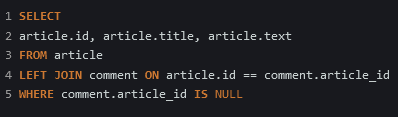
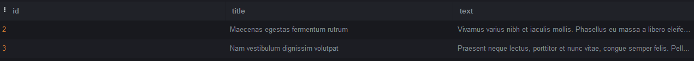

<h1 align="center">Тестовое задание</h1>
 
<h2 align="left">Задание 1 - БД</h2>
Не до конца был уверен в каком формате выполнить задание.
Код непосредственно лежит в "migration+query.py". Ниже продублирую скришотами самого запроса и результата, чтобы не 
нужно было накатывать psycopg2/тестить напрямую
 
 

 
<h2>Задание 2 - Код</h2>
Сам код лежит в "main.py", входные данные в "input_example.txt". Входные данные были продублированы
и добавлены несколько новых строк того же формата. В код добавил вывод конкретного работника/работников, т.к. формулировка задания 
показалась неоднозначной.

<h3 align="center">Надеюсь, смог достаточно понятно объяснить определенные нюансы</h3>